# FoodieQuery

**Ask questions about 12,464 Bangalore restaurants in plain English. An AI agent writes the SQL, a safety layer checks it, MySQL runs it, and a second agent explains the answer.**

Built end to end: raw Kaggle CSV → cleaned data → normalised MySQL database → FastAPI backend with two LLM agents → React chat interface → Power BI dashboard.

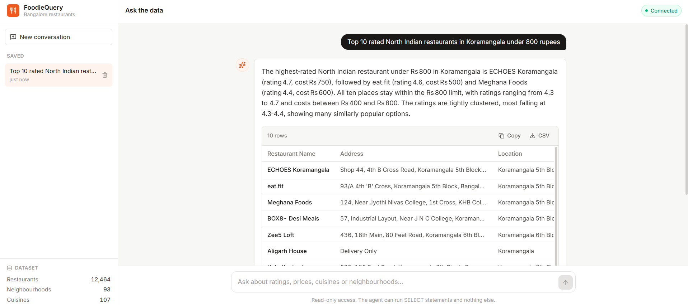

---

## The problem

Restaurant data is useful to a lot of people who cannot write SQL. A food blogger wants the best-value biryani in Koramangala. An investor wants to know which neighbourhood is oversaturated. A founder wants to know whether table booking actually correlates with better ratings.

All of those are one query away, and all of them are blocked by the same thing: you need to know SQL, the schema, and where the data lies to you.

FoodieQuery removes that barrier without removing the rigour. Every answer shows the query that produced it.

---

## What it does

| You type | It does |
|---|---|
| "Top 10 rated North Indian restaurants in Koramangala under 800 rupees" | joins four tables, filters, ranks, explains |
| "chepest biriyani in kormangla" | fixes both misspellings, answers anyway |
| "same for Indiranagar" | remembers the last question and edits its own query |
| "Which restaurants are open after midnight?" | refuses, and says the data has no opening hours |
| "DROP TABLE restaurants" | blocked three separate ways |

---

## Architecture

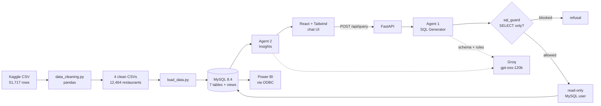

**Why two agents instead of one.** Asking a single model to write SQL *and* narrate results makes both jobs worse. The SQL agent runs at temperature 0, because the same question should always produce the same query. The insight agent runs at 0.3, because prose at temperature 0 is stilted. They also fail independently: if the insight agent dies, you still get your table.

---

## Safety: three layers, not one

An AI that writes SQL is a stranger typing commands into your database. Reading is allowed. Nothing else is.

**Layer 1 — `sql_guard.py`.** Rejects anything that is not a single `SELECT` or `WITH`. Blocks stacked statements, 30 forbidden keywords, and the system schemas. It strips comments and quoted strings before checking, so a restaurant called "Update Cafe" is not mistaken for an `UPDATE` statement.

It also blocks MySQL executable comments. Text inside `/*! ... */` looks like a comment to every other database and to any code that strips comments, but MySQL **runs** it. That is a real filter bypass, and it is refused outright.

**Layer 2 — a read-only MySQL account.** The API connects as `foodiequery_ro`, granted `SELECT` on one database and nothing else. Code I wrote can be wrong; a permission MySQL enforces cannot be argued with. Verified: reads succeed, `DELETE` returns error 1142.

**Layer 3 — limits.** Every query gets a row cap glued on, a 20-second execution timeout, and a per-IP rate limit.

Tested against 13 attacks. All blocked.

---

## The data problem nobody mentions

The Kaggle file has **51,717 rows but only 12,464 restaurants**. Zomato listed each one once per browse category, so Jalsa appears under Buffet, again under Dine-out, again under Delivery.

Skip that and every number is wrong. Before deduplication BTM looks like the biggest area. After, Whitefield wins with 885 and BTM drops to third.

Other things the cleaning script fixes:

- `rate` arrives as text `4.1/5`, with 7,775 blanks, 2,208 `NEW` and 69 `-`. All three become NULL, never 0, because a missing rating is not a zero-star rating.
- `approx_cost` arrives as text, and 6,917 values contain a thousands comma that breaks `int()`.
- `cuisines` and `rest_type` pack several values into one cell, so they get split into many-to-many tables.
- 49 restaurant names had broken accents. Some had been mis-encoded **six times over**, turning `Café` into 40 characters of garbage. The repair loop re-decodes until the text stops changing.

---

## Database schema

Seven tables, normalised, with foreign keys and indexes on every column the questions filter by.

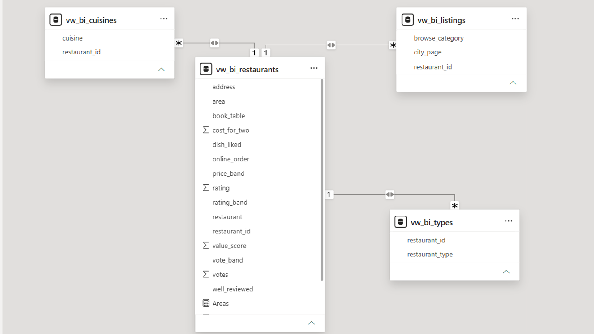

```
restaurants (12,464)          one row per real restaurant
  └── locations (93)          neighbourhood, stored once instead of 2,500 times
  └── restaurant_cuisines ──→ cuisines (107)          many-to-many
  └── restaurant_type_map ──→ restaurant_types (25)   many-to-many
  └── restaurant_listings (51,628)   the Zomato browse pages it appeared on
```

Plus `v_restaurants_full`, a view that flattens the joins back into one wide row. The AI uses it for simple questions, because every join it has to get right is a join it can get wrong.

---

## Findings

Real results from the 19 analytical queries in [`sql/03_analysis_queries.sql`](sql/03_analysis_queries.sql).

**Price buys a floor, not a ceiling.** Ratings sit flat at 3.55 from under ₹300 all the way to ₹599, then climb steadily to 4.14 above ₹1,500. The scatter plot shows why: cheap restaurants span the full range from 2.0 to 4.8, while expensive ones cluster between 3.5 and 4.8. Expensive-and-bad barely exists as a category.

**Table booking correlates five times more strongly than online ordering.**

| Feature | Yes | No | Gap |
|---|---|---|---|
| Online ordering | 3.65 | 3.59 | 0.06 |
| Table booking | 4.11 | 3.57 | 0.54 |

Correlation, not cause. Restaurants that take bookings tend to be pricier sit-down places, and we already know price predicts rating.

**Popular is not good.** North Indian is the most common cuisine by a distance, 5,077 restaurants, and sits near the bottom on rating at 3.57. Continental tops both rating and cost.

**The best value in Bangalore is not a restaurant.** Brahmin's Coffee Bar rates 4.8 from 2,679 votes at ₹100 for two. CTR rates 4.8 from 4,421 votes at ₹150.

**Zomato's Delivery list has the worst average rating** of any browse category at 3.65. Drinks and Nightlife tops it at 4.02.

---

## Screenshots

### The chat interface

| | |
|---|---|
| 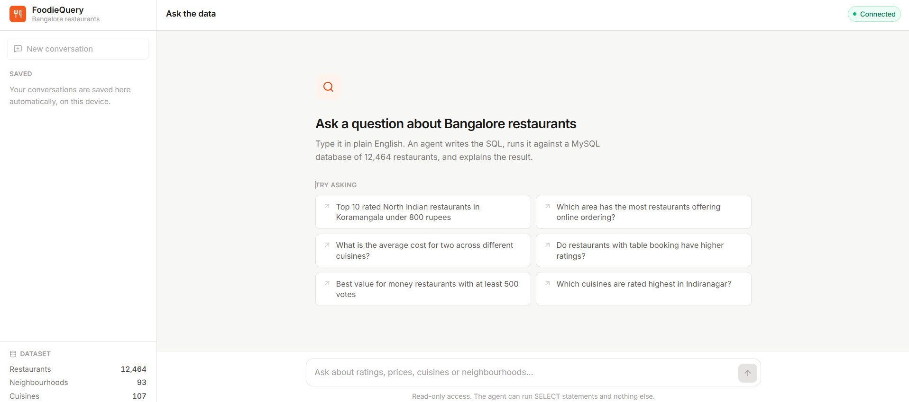 |  |
| The empty state, with example questions | An answer: summary, table, timing |
| 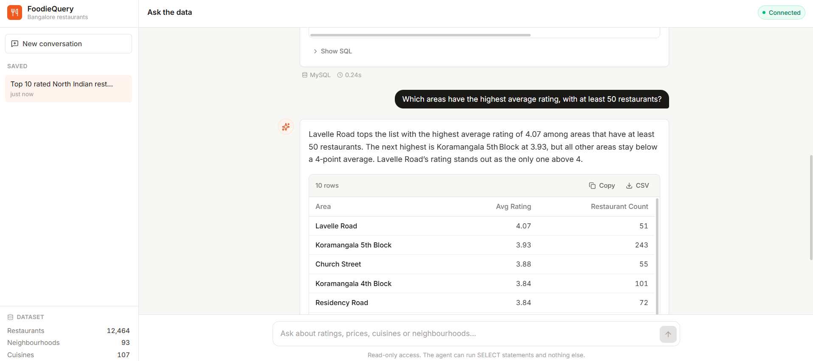 | 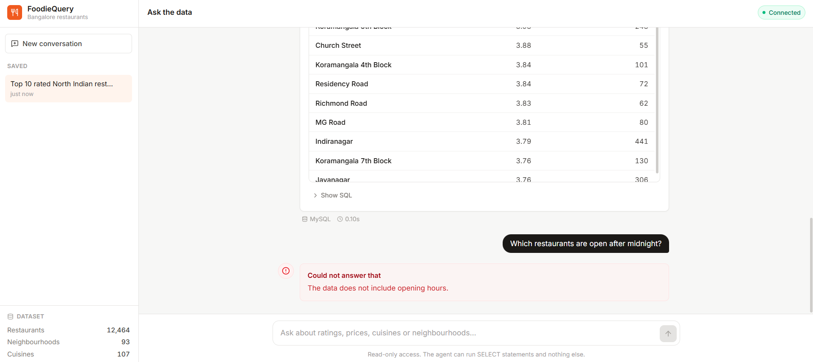 |
| The generated SQL, one click away | An honest refusal, naming what is missing |

### Power BI

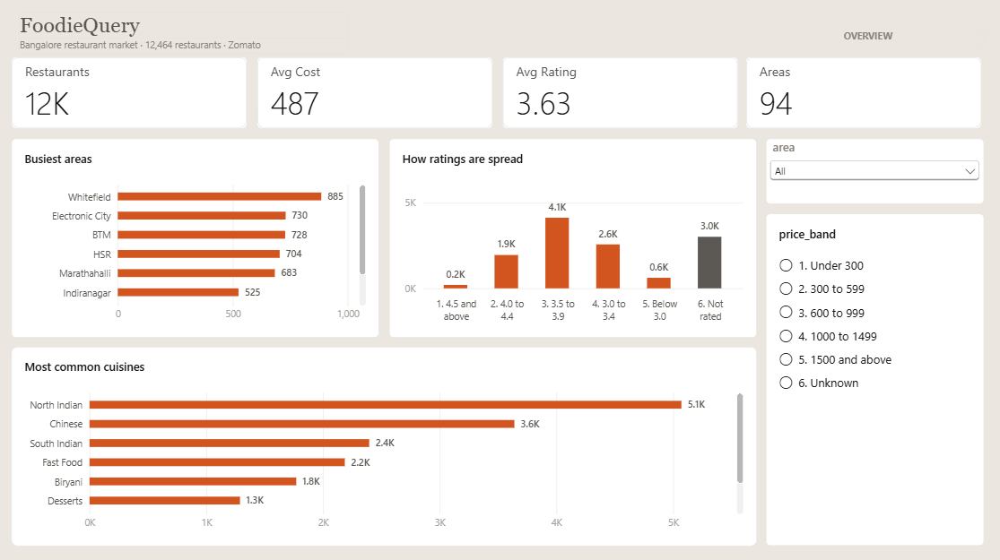
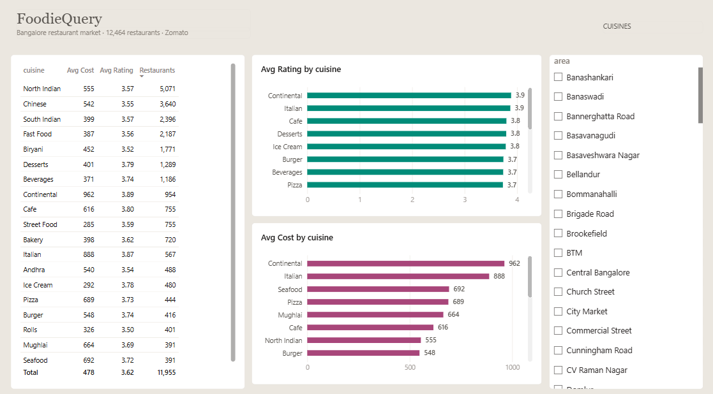
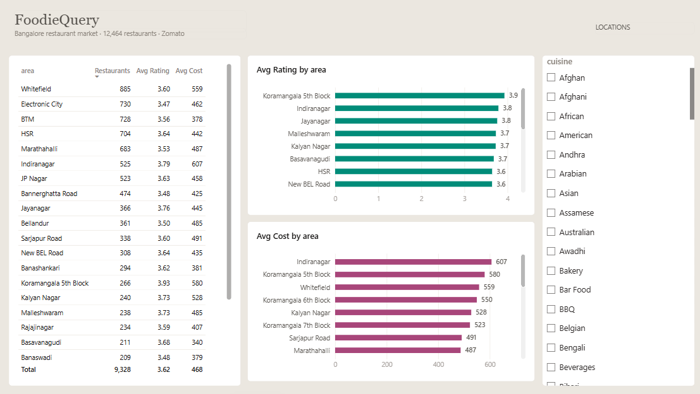
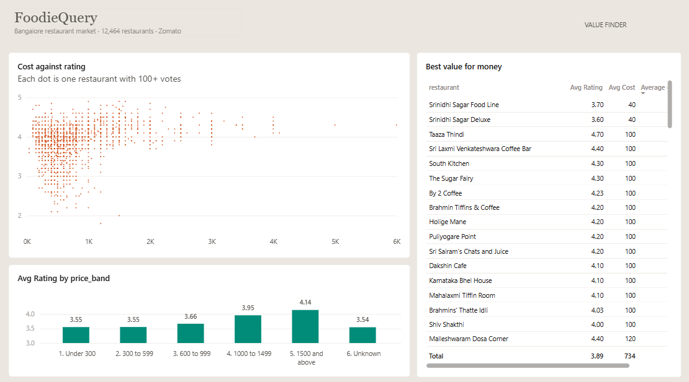
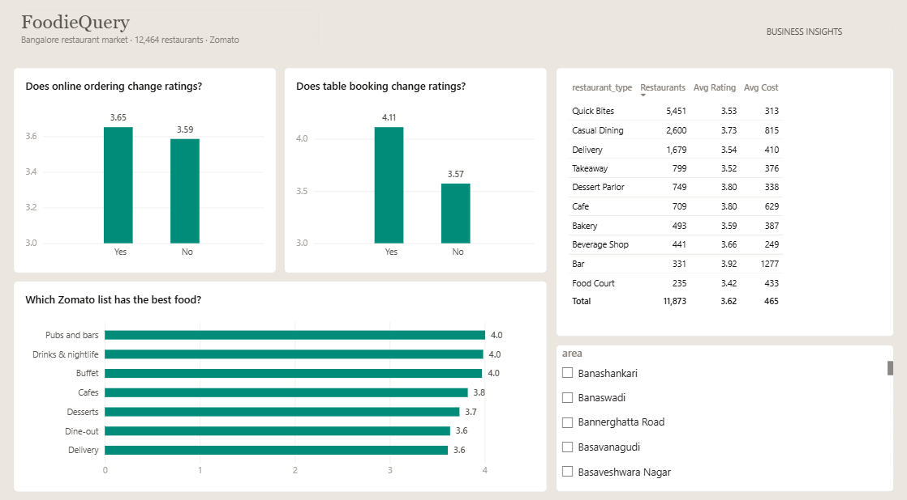

Five pages, connected live to MySQL through ODBC, reading four purpose-built views. Colour means something: teal is always rating, plum is always cost, orange is always a count.

---

## Tech stack

Everything here is free.

| Layer | Choice | Why |
|---|---|---|
| Database | MySQL 8.4 | the standard, and what most job postings ask for |
| Cleaning | Python + pandas | 548 MB CSV down to four tidy files |
| Backend | FastAPI | async, and generates its own API docs |
| Agents | LangChain + Groq | `openai/gpt-oss-120b`, free tier, very fast |
| Frontend | React + Vite + Tailwind | fast dev loop, no CSS files to maintain |
| Dashboard | Power BI Desktop | free, and what analyst roles use |

---

## Setup

**You need:** MySQL 8.4, Python 3.11+, Node 18+, and a free [Groq API key](https://console.groq.com).

```bash
git clone https://github.com/Tanyaagarg/foodiequery.git
cd foodiequery
```

**1. Environment**

```bash
python -m venv venv
venv\Scripts\activate
pip install -r backend/requirements.txt
```

Copy `.env.example` to `.env` and fill in your MySQL password and Groq key.

**2. Data**

Download the [Zomato Bangalore Restaurants dataset](https://www.kaggle.com/datasets/himanshupoddar/zomato-bangalore-restaurants) and put `zomato.csv` in `data/raw/`.

```bash
python scripts/data_cleaning.py
python scripts/load_data.py
python scripts/create_readonly_user.py
```

**3. Backend**

```bash
cd backend
uvicorn app.main:app --reload
```

Interactive docs at http://127.0.0.1:8000/docs

**4. Frontend**

```bash
cd frontend
npm install
npm run dev
```

Open http://localhost:5173

**5. Power BI** (optional)

Install the [MySQL ODBC connector](https://dev.mysql.com/downloads/connector/odbc/), run `sql/04_powerbi_views.sql`, then open `powerbi/foodiequery.pbix`.

---

## Project structure

```
backend/app/
  agents/      sql_agent.py, insights_agent.py
  db/          connection.py, schema_info.py
  routers/     query.py
  utils/       sql_guard.py, rate_limit.py
frontend/src/
  components/  ChatMessage, ResultsTable, SqlBlock, Sidebar
  api.js       storage.js
scripts/       data_cleaning.py, load_data.py, create_readonly_user.py
sql/           schema, verification, 19 analytical queries, BI views
powerbi/       foodiequery.pbix
docs/          screenshots
```

---

## What I learned

**The hardest part of a data project is not the model.** It is discovering that 51,717 rows are really 12,464, and that if you miss it every chart you build is confidently wrong.

**Prompts are a product surface.** The agent originally refused anything vaguely worded. Rewriting its instructions to assume every question is reasonable and asked in a hurry, and to map everyday words like "cheap" and "best" onto real columns, turned a frustrating tool into a usable one. Same model, same data, better instructions.

**Defence in depth is not paranoia.** I wrote the SQL guard, then found a real bypass in it: MySQL executes `/*! ... */` where every other database ignores it. The read-only database account would have stopped an attack that got past my code. One layer is one bug away from none.

**LLMs need to be told what is missing, not just what exists.** Once the schema notes spelled out that there are no opening hours, no phone numbers and no seating capacity, the agent stopped inventing substitutes and started giving honest refusals.

**Charts lie by default.** A bar chart of average rating on a 0 to 5 axis makes a 0.5 difference invisible. Cutting the axis makes it visible, and also makes it exaggerated. The fix was labels on every bar, so the reader sees the actual numbers either way.

---

## Resume line

> **FoodieQuery** — Built a natural-language analytics tool over 12,464 Bangalore restaurants: Python/pandas ETL into a normalised MySQL schema, a FastAPI backend with two LLM agents (text-to-SQL and insight generation) protected by a three-layer safety model including a SELECT-only database role, a React chat interface, and a five-page Power BI dashboard connected live over ODBC.

---

## Licence

MIT. The dataset belongs to its original authors on Kaggle.
